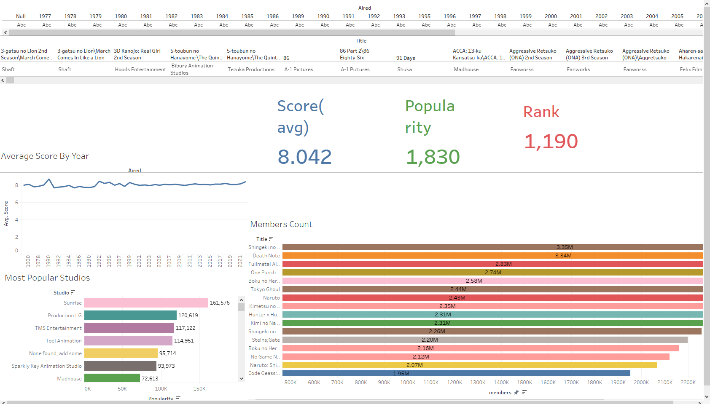
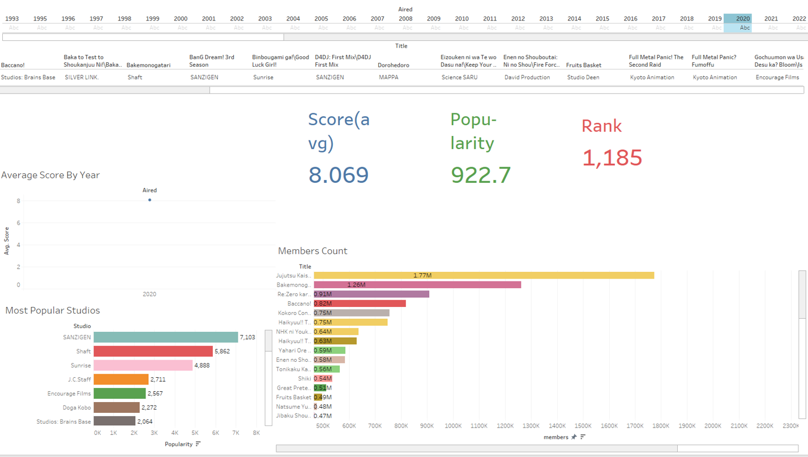
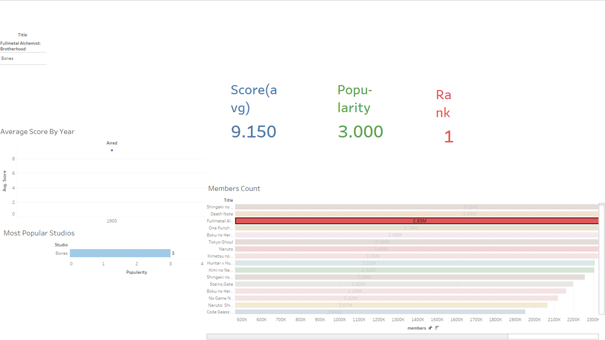
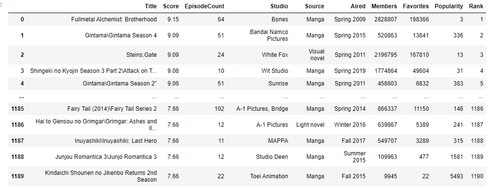
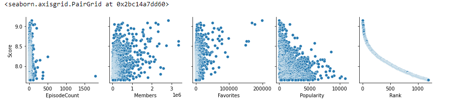
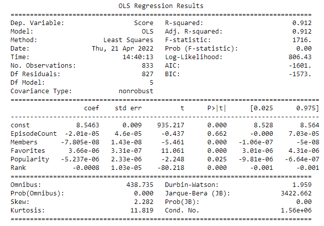

# Anime_Score_learning_ML
Capstone project, for Machine learning anime review scores

# Overview
The main goal for this project is to scrap data using a python we scraper like beautiful soup to scrap information from the website https://myanimelist.net/.
After cleaning the data, the main goal is to create a machine learning model (linear regression) to find out which of the attributese of each show correlates to increase
scoring of the show and its reviews.

# Selenium Scraper
Chrome Version : Version 99.0.4844.82
The Scraper.py file is the program/code to run to scrap from Myanimelist.net. The Chrome version's driver is already placed in the repo.
To change the number of pages scraped just change Num_pages on line 38 to the desired amount.
Currently Scraping;
score, rating, rank, popularity, members, episode count, premiered, studio, and source material.

# Tableau Dashboard
Here are some Taleau Dashboards that were made for some surface level data analysis and visualization.
 
The first one is the general dashboard, followed by the 2020 only data, and then only the top ranked show.

# Linear Regression
After doing some surface level data analysis in Tableau, some data visualization was done using seaborn and matplotlib packages in python.
 
Then a linear regression model was built to predict the tv show's score on Myanimelist.net

The final result being a r-score of 0.912

# Video
Milestone 1
https://mediaspace.wisconsin.edu/media/1_afyhu10o
Milestone 2
https://mediaspace.wisconsin.edu/media/Kaltura+Capture+recording+-+March+23rd+2022%2C+4A19A36+pm/1_9l51wtki
